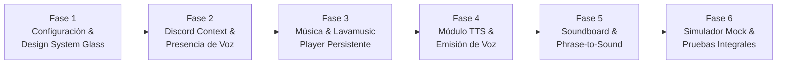

# 📋 Plan de Desarrollo por Fases: Discord Bot Dashboard Frontend

Este plan desglosa la construcción completa del frontend para el panel de control del bot de Discord en **6 fases detalladas**, adoptando el sistema de diseño **Glassmorphism** y la paleta cobalto/blurple inspirada en el proyecto `tasks`.

---

---

## 🔹 Fase 1: Arquitectura Base y Sistema de Diseño Glassmorphism
> **Objetivo:** Establecer la estructura del proyecto en `frontend/`, configurar las directivas de Tailwind CSS, fuentes y variables de color heredadas de `tasks` para lograr el estilo de cristal traslúcido.

### Tareas Detalladas:
1. **Configuración de Estilos Globales (`app/globals.css`)**:
   - Variables CSS de raíz: `--accent: #2563eb` (modo claro) y `--accent: #60a5fa` (modo oscuro), sumando acentos Discord Blurple (`#5865F2`).
   - Clases maestras de cristal:
     - `.glass-panel`: Fondo semitransparente con `backdrop-filter: blur(28px)`, borde `rgba(255,255,255,0.14)` y sombra difusa.
     - `.glass-input`: Input translúcido con foco en el acento.
     - `.glass-btn`: Botones con efecto hover sutil y transición fluida.
     - `.glass-pill`: Píldoras activas/inactivas para filtros y pestañas.
     - `.custom-scrollbar`: Scrollbar fino estilizado.
2. **Layout Raíz (`app/layout.tsx`)**:
   - Fuente sans moderna (`Inter`).
   - Metadata de la aplicación: `"Ignite · Discord Bot Controller"`.
   - Soporte para tema claro y oscuro (Dark / Light mode persistente).
3. **Componentes UI Base**:
   - `components/theme-toggle.tsx`: Botón para alternar modo claro/oscuro con iconos Sun/Moon de Lucide.
   - `components/glass-modal.tsx`: Modal flotante con backdrop difuminado y cierre accesible con tecla Escape y clic externo.

---

## 🔹 Fase 2: Autenticación Discord, Selector de Servidor y Presencia en Canal de Voz
> **Objetivo:** Simular la sesión de Discord con OAuth, selección de servidor (guild) y monitoreo en tiempo real de si el usuario está en un canal de voz y cuál.

### Tareas Detalladas:
1. **Barra de Navegación Principal (`components/app-nav.tsx`)**:
   - Logotipo de la aplicación con indicador de estado del bot (🟢 Online / Latencia: 24ms).
   - Perfil de usuario de Discord: avatar, nombre de usuario (`@alex_gamer`), tag y menú desplegable de cuenta.
   - Selector interactivo de servidor (Guilds disponibles con iconos, nombres y cantidad de miembros).
2. **Banner / Indicador de Presencia de Voz (`components/voice-banner.tsx`)**:
   - Detección del estado de llamada del usuario:
     - **Estado Conectado (🟢)**: Muestra el canal actual: `🔊 General · 64 kbps · 3 usuarios en sala`.
     - **Estado Desconectado (🔴)**: Banner de alerta preventiva: *"No estás conectado a ningún canal de voz. Conéctate en Discord para reproducir audio o TTS"*.
   - **Simulador de Presencia**: Controles para cambiar de canal (`General`, `Gaming Voice`, `Música`) o desconectarse, permitiendo testear cómo reacciona toda la web ante cada estado.
3. **Store Central de Estado (`context/bot-context.tsx`)**:
   - Estado del usuario autenticado, servidor activo, canal de voz actual, cola musical, reproductor y disparadores.

---

## 🔹 Fase 3: Módulo de Música (Lavamusic Engine) & Floating Player Bar
> **Objetivo:** Implementar el catálogo musical, buscador multi-fuente, soporte para links (Spotify, SoundCloud, YouTube), gestión de cola y la barra inferior de reproducción continua con scrubber de minuto.

### Tareas Detalladas:
1. **Catálogo y Recomendaciones (`components/music/music-catalog.tsx`)**:
   - Carrusel / Cuadrícula de recomendaciones por categorías (Lo-Fi Chill, Gaming Beats, Synthwave, Rock Clásico).
   - Tarjetas de canción con carátula en alta resolución, nombre, artista, duración y badge de fuente.
   - Botón directo de **"Reproducir ahora"** y botón **"Añadir a la cola"**.
2. **Buscador Universal y Entrada de Enlaces (`components/music/music-search.tsx`)**:
   - Input con filtrado en tiempo real en el catálogo.
   - Soporte inteligente para pegar URLs de **Spotify** (`open.spotify.com/...`), **SoundCloud** y **YouTube** (`youtu.be/...`).
   - Mock parser que simula la importación de canciones o playlists completas a la cola.
3. **Gestor de Cola de Reproducción (`components/music/queue-drawer.tsx`)**:
   - Lista interactiva de temas en espera con tiempo restante acumulado.
   - Opciones para saltar a un tema específico, eliminar pista individual o vaciar la cola.
4. **Barra de Reproducción Persistente Flotante (`components/music/player-bar.tsx`)**:
   - Carátula, título y artista del tema en reproducción actual.
   - Controles de transporte: Anterior, Play/Pause, Siguiente (Skip), Bucle (Off / Pista / Cola), Aleatorio (Shuffle).
   - **Scrubber de tiempo interactivo**: Barra de progreso que avanza automáticamente cada segundo (ej. `01:23 / 03:45`) y permite hacer clic o arrastrar para adelantar el minuto.
   - Control de volumen interactivo con slider (0% a 100%) y botón de silencio (Mute).

---

## 🔹 Fase 4: Módulo Text-to-Speech (TTS)
> **Objetivo:** Proveer una consola interactiva donde escribir mensajes de texto y transmitirlos como audio hablado en el canal de voz de Discord a través del bot.

### Tareas Detalladas:
1. **Editor de Mensajes TTS (`components/tts/tts-view.tsx`)**:
   - Cuadro de texto amplio con contador dinámico de caracteres (máx. 250 caracteres por emisión).
   - Limpieza rápida y atajos de mensajes rápidos (ej. *"¡Todos a jugar!"*, *"Buenas noches"*, *"AFK 5 minutos"*).
2. **Selector de Voces y Personalización de Audio**:
   - Selector con distintas voces sintetizadas (Español Neutro Jorge, Español Lucía, English Brian, Voz Robótica Cyber, Voz Anime).
   - Controles deslizantes para regular la velocidad (0.5x a 2.0x) y el tono (Pitch).
3. **Botón de Transmisión al Canal de Voz**:
   - Indicador visual del canal de destino (`🔊 Emitiendo en General`).
   - Animación de onda sonora al transmitir.
   - Síntesis de voz real en el navegador mediante la API nativa de voz (`window.speechSynthesis`) para poder escuchar el TTS inmediatamente durante las pruebas.
4. **Historial de Mensajes Recientes**:
   - Lista de las últimas frases enviadas con botón de re-emisión rápida en un clic.

---

## 🔹 Fase 5: Soundboard y Phrase-to-Sound (Disparador por Palabras Clave)
> **Objetivo:** Desarrollar el soundboard interactivo con catálogo de efectos (con o sin emojis) y el sistema de mapeo de frases que activa sonidos cuando se pronuncian o escriben en Discord.

### Tareas Detalladas:
1. **Catálogo de Soundboard (`components/soundboard/soundboard-view.tsx`)**:
   - Grid de botones de sonido estilizados con cristal, con emojis grandes (📢 Airhorn, 🎻 Sad Violin, 🎺 Ta-Da, 💥 Ba-Dum Tss, 🤖 Bruh, 🦆 Quack, etc.).
   - Filtros por categoría (Memes, Juegos, Reacciones, Efectos) y barra de búsqueda.
   - **Motor de audio para pruebas**: Uso de Web Audio API para reproducir sintetizadores y efectos sonoros reales al presionar los botones.
   - Modal para añadir nuevos sonidos al catálogo (nombre, emoji opcional, categoría).
2. **Módulo Phrase-to-Sound (`components/phrase-to-sound/phrase-view.tsx`)**:
   - Visualización de frases registradas (ej. Palabra *"GG"* ➡️ Sonido *Airhorn*).
   - Interruptor para activar/desactivar cada disparador individualmente.
   - Configuración de tipo de coincidencia (Exacta / Contiene la palabra).
   - Botón **"Simular detección"**: Simula que un usuario en Discord acaba de pronunciar la palabra y dispara el sonido en tiempo real.
   - Modal para vincular nuevas frases con sonidos de la base de datos.
3. **Consola de Eventos en Vivo (Live Activity Log)**:
   - Feed lateral de eventos que muestra las detecciones recientes: `[Voz] Alex dijo "GG" ➜ Reproduciendo 📢 Airhorn`.

---

## 🔹 Fase 6: Integración Global, Datos Mockeados y Verificación
> **Objetivo:** Unificar todos los módulos bajo una navegación por pestañas fluida, verificar responsividad en móvil y escritorio, y documentar la preparación para la conexión con la API del bot real.

### Tareas Detalladas:
1. **Integración en la Página Principal (`app/page.tsx`)**:
   - Pestañas superiores estilizadas: **Música**, **TTS**, **Soundboard & Phrase-to-Sound**.
   - Integración del Player flotante que no interrumpe la navegación entre pestañas.
2. **Validación de Casos de Uso Mockeados**:
   - Simular usuario dentro vs fuera de canal de voz.
   - Búsqueda y reproducción de canciones desde catálogo y desde URLs.
   - Emisión de frases TTS y comprobación de audio en navegador.
   - Disparo de sonidos individuales y por coincidencia de frases.
3. **Estructura de Contrato para el Backend**:
   - Documentación de las rutas mockeadas en `lib/mock-data.ts` diseñadas para sustituirse fácilmente por llamadas a la API REST y WebSockets del bot (Discord.js / Lavalink / Python).
